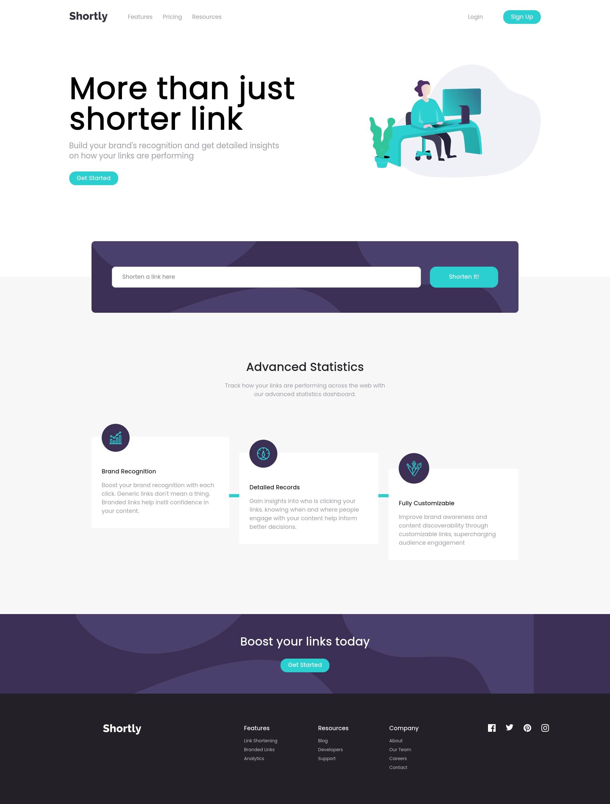

# Frontend Mentor - Shortly URL shortening API Challenge solution

This is a solution to the [Shortly URL shortening API Challenge challenge on Frontend Mentor](https://www.frontendmentor.io/challenges/url-shortening-api-landing-page-2ce3ob-G). Frontend Mentor challenges help you improve your coding skills by building realistic projects.

## Table of contents

- [Overview](#overview)
  - [The challenge](#the-challenge)
  - [Screenshot](#screenshot)
  - [Links](#links)
- [My process](#my-process)
  - [Built with](#built-with)
  - [What I learned](#what-i-learned)
  - [Continued development](#continued-development)
  - [Useful resources](#useful-resources)

## Overview

### The challenge

Users should be able to:

- Shorten any valid URL
- See a list of their shortened links, even after refreshing the browser
- Copy the shortened link to their clipboard in a single click
- Receive an error message when the `form` is submitted if:
  - The `input` field is empty

### Screenshot



### Links

- Live Site URL: [Preview](https://azanra.github.io/url-shortening/)

## My process

### Built with

- React
- TinyUrl [API](https://tinyurl.com/)
- Local Storage to persist the data

### What I learned

The api that mentioned in the requirement require to run in it our own server. Hence i use different api that can be using immediately from the front end. To use fetch on this api. We need to put the api key that we got from the tinyurl into our request header.

```js
const requestOption = {
  method: "POST",
  headers: {
    Authorization: `Bearer ${API_KEY}`,
    "Content-Type": "application/json",
    accept: "application/json",
  },
  body: JSON.stringify(data),
};
```

But if it like this our API key are publicly available. from what i read to how to hide it.

- Calling the api key from our backend as a proxy. and the frontend will be communicating with our backend instead of directly with the API. this way the API key will can't be found from the network console.

But since i dont understand any be yet. i look some alternative like Netlify Function that will run our backend code instead of creating and running our server. They way they hide it similiar, they will become proxy for our API call. but for some reason my call always failed when running the Netlify function. I will hold on to it, since the goal of this project is to get more practice on fetching data with API on react and it's free API key it shouldn't be a problem (i hope).

Even if i hide it in .env and put the env into gitignore, since i deployed it on gh pages. the api call wouldn't work without the API key. Other option
are asking the user to input their own API key and use it into request headers. but this will be my last resort.

Using async and await on the API call

```js
async function urlClient() {
  const response = await fetch(API_URL, requestOption);
  return response;
}
```

await are syntatic sugar on then. it will hold on moving into the next line until the promise is resolved / failed (fetch in this case), before returning the response. async is needed to use await keyword, and it will wrap whatever it return with promises. that's why i put await when setting url state, so that it return the shortened url instead of the promises.

```js
const handleUrl = async () => {
  if (isValidUrl(link)) {
    setUrl([
      ...url,
      {
        id: url.length,
        originalUrl: link,
        shortenedUrl: await urlClient(link),
      },
    ]);
  }
  ////
};
```

To make the data persist, we can use localStorage. the data will be saved on user (with the key name of url and it values the JSON string of our url,since we need to convert it into JSON format first and parse it if we want to use it) client whenever the url (the one in the dependancy array) is updated with useEffect hooks.

useEffect will execute the function inside of it and will run it depending on the items mentioned in the dependancy array. in this case, it will only run whenever the url state is changed.

```js
useEffect(() => {
  if (url.length > 0) {
    const stringUrl = JSON.stringify(url);
    localStorage.setItem("url", stringUrl);
  }
}, [url]);
```

To load the data if the user refresh or quit the tab. it will check if the user have url in their localStorage, and use it value as the initial value of the url state

```js
const initialUrl = JSON.parse(localStorage.getItem("url"));
return <Url initalUrl={initialUrl === null ? [] : initialUrl} />;

function Url({ initalUrl }) {
  const [url, setUrl] = useState(initalUrl);
  ///
}
```

### Continued development

- Hide the API key either with backend or Netlify function

### Useful resources

- [Hide API keys freecodecamp](https://www.freecodecamp.org/news/hide-api-keys-in-frontend-apps-using-netlify-functions/)
- [Using netlify function on react](https://pineview.io/build-test-and-deploy-an-app-react18-vite-netlify-nightwatch/)

- For explanation on how to hide the API key with Netlify Function
